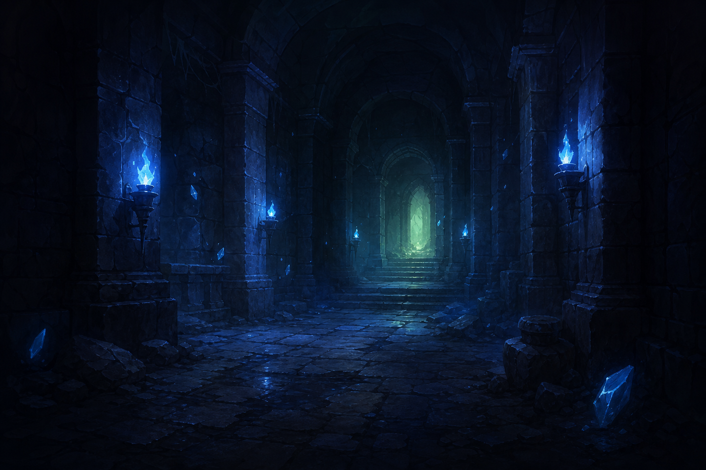

# ABYSS CROWN



`ABYSS CROWN` 是一个 C++17 + SDL2 开发的 2D 俯视角像素地牢小游戏。玩家在暗色地牢中移动角色，收集 3 个蓝色记忆碎片，避开紫色危险区域，并找到绿色出口。

项目按 `docs/DESIGN.md` 的设计实现，使用 SDL2 绘制地图、SDL2_ttf 渲染界面文字，并使用 AI 生成的暗色地牢背景图美化标题页。AI 部分默认使用规则 AI；llama.cpp 是可选增强，没有本地模型也能完整游玩。

游戏地图和主角采用统一原创像素风。墙体、地板、记忆碎片、出口、危险区域和披风探险者素材保存在 `assets/images/pixel/`。

## Windows + CLion 快速开始

推荐甲方使用：

- Windows 10/11 x64
- Git for Windows
- JetBrains CLion
- MinGW Toolchain
- CMake 3.21+
- Ninja

克隆仓库后，在项目根目录运行：

```powershell
git clone https://github.com/Hyacinth-xinyu/abyss-crown.git
cd abyss-crown
```

然后运行：

```bat
scripts\setup_windows_clion.bat
```

脚本会下载并初始化 vcpkg。完成后重启 CLion，打开仓库根目录，并选择：

- CMake Preset：`Windows MinGW Debug (vcpkg)`
- Toolchain：`MinGW`
- Run Target：`abyss_crown`

CLion 会通过 `vcpkg.json` 自动安装 SDL2 和 SDL2_ttf。CMake 构建后会自动复制游戏资源、配置和 Windows 运行时 DLL。

完整步骤和故障排查见：

[docs/WINDOWS_CLION_SETUP.md](docs/WINDOWS_CLION_SETUP.md)

## macOS 开发环境

- macOS
- VS Code
- Apple clang++，用于编译 C++17
- `make`
- SDL2
- SDL2_ttf

检查 SDL2：

```bash
sdl2-config --version
```

如果没有安装 SDL2：

```bash
brew install sdl2
```

如果没有安装 SDL2_ttf：

```bash
brew install sdl2_ttf
```

建议安装 VS Code 扩展：

- `C/C++`
- `CodeLLDB`

## 编译和运行

macOS 可以继续使用现有 Makefile：

在项目目录中执行：

```bash
make
```

运行游戏：

```bash
make run
```

清理编译产物：

```bash
make clean
```

## 主菜单操作

- 鼠标移动到按钮：高亮按钮
- 鼠标左键：点击 `开始游戏`、`游戏说明`、`游戏设置` 或 `退出游戏`
- 上下方向键：切换菜单选项
- `Enter` 或 `Space`：确认菜单选项
- `Esc`：在说明页返回主页，在主页退出游戏

## 游戏操作

- `WASD`：移动角色并转向对应方向
- 方向键：移动角色并转向对应方向
- `Esc`：打开暂停菜单
- 暂停菜单支持鼠标、上下方向键、`Enter` 和 `Space`
- 暂停菜单选择 `退出游戏` 后需要二次确认，确认后返回主菜单
- 胜利或失败结算页支持鼠标、方向键、`WASD`、`Enter` 和 `Space`
- 结算页按 `Esc` 可直接返回主菜单

## 玩法说明

- 暖棕色披风探险者是玩家。
- 亮蓝色像素水晶是记忆碎片，需要收集 3 个。
- 绿色像素符文门是出口。
- 紫红色裂纹地砖是危险区域，踩上去会扣生命值。
- 低亮度炭灰石砖墙不可通过。
- 开始页包含英文游戏名、中文副标题、游戏目标、AI 模式和三个菜单按钮。
- 点击 `游戏说明` 可以进入独立说明页面，查看规则、操作和通关方式。
- 点击 `游戏设置` 可以开关背景粒子、页面淡入动画和王座回声提示。
- 右侧状态面板会显示中文生命值、记忆碎片和通关目标。
- 底部 `王座回声` 面板会直接显示中文提示。
- 顶部窗口标题也会同步显示生命值、碎片数量和 AI 提示。
- 胜利和失败使用独立 AI 背景图，轻松像素冒险文案会直接叠加在背景上。
- 结束页使用无框横向统计，显示本局碎片、剩余生命、成功移动步数和挑战用时。
- 结束页可以选择 `再跑一次` 或 `先回营地`。

## llama.cpp 可选配置

默认配置位于 `config/game_config.txt`：

```text
llama_enabled=false
llama_executable=
llama_model=
```

如果后续要启用 llama.cpp：

```text
llama_enabled=true
llama_executable=/path/to/llama-cli
llama_model=/path/to/model.gguf
```

如果 llama.cpp 路径错误、模型缺失或调用失败，游戏会自动回退到规则 AI，不影响游玩。

## 文档

- `docs/REQUIREMENTS.md`：需求文档
- `docs/DESIGN.md`：设计文档
- `docs/TEST_PLAN.md`：测试文档
- `docs/WINDOWS_CLION_SETUP.md`：Windows + CLion 部署说明

## 项目结构

```text
cpp_llama_adventure/
├── Makefile
├── CMakeLists.txt
├── CMakePresets.json
├── vcpkg.json
├── README.md
├── LICENSE
├── assets/
│   └── images/
│       ├── title_background.png
│       ├── title_background.bmp
│       ├── victory_background.png / victory_background.bmp
│       ├── defeat_background.png / defeat_background.bmp
│       └── pixel/
│           ├── floor.png / floor.bmp
│           ├── wall.png / wall.bmp
│           ├── shard.png / shard.bmp
│           ├── exit.png / exit.bmp
│           ├── danger.png / danger.bmp
│           ├── player_up.png / player_up.bmp
│           ├── player_down.png / player_down.bmp
│           ├── player_left.png / player_left.bmp
│           └── player_right.png / player_right.bmp
├── config/
├── docs/
├── include/
├── scripts/
└── src/
```

## 当前版本说明

当前版本已经具备像素地牢主菜单、自绘像素标题、四项中文菜单、分区游戏说明、运行时游戏设置、鼠标与键盘双操作、背景粒子、淡入效果、中文 HUD、王座回声提示以及完整胜负结算页面。除英文游戏名 `ABYSS CROWN` 外，窗口界面均使用中文。

地图和主角已统一为原创像素风，并使用最近邻缩放保持清晰边缘。像素纹理加载失败时会自动回退到原有色块绘制，因此素材缺失不会阻止游戏运行。

主角会根据移动方向显示对应的正面、背面、左侧或右侧像素素材；即使前方是墙体无法移动，也会先完成转身。游戏进行中按 `Esc` 会打开暂停菜单，不会直接关闭程序。

胜利页采用绿色出口与金色曙光背景，并显示“溜出去啦！”；失败页采用破碎王冠与红色余烬背景，并显示“差一点点！”。两种结算页面都使用无大面板的轻量布局，会冻结本局统计，并提供再跑一次与先回营地操作。

## 开源许可

项目源码使用 MIT License。项目内 Noto Sans CJK 字体使用 SIL Open Font License 1.1，详见 `THIRD_PARTY_NOTICES.md`。
